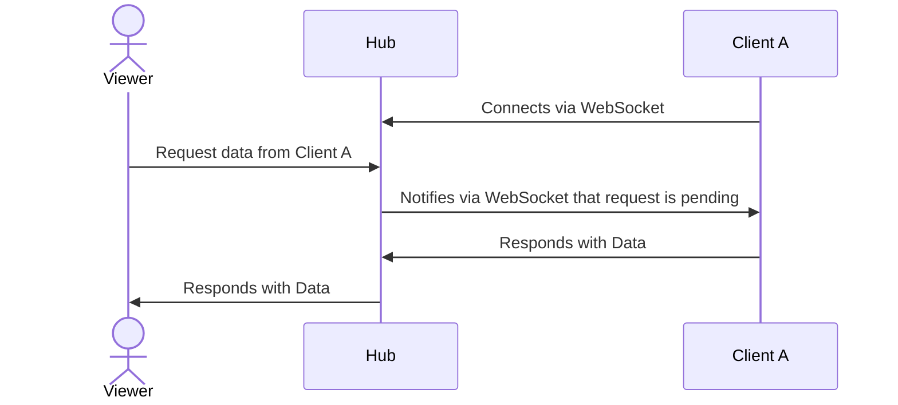

I have been wanting to try a project in [rust](https://www.rust-lang.org/) for a few years now, and a few days ago, I finally started. My idea seemed simple. I wanted to create a "hub" service that can be connected to from an arbitrary number clients. Once clients are connected, a viewer can make a request to the hub and quickly pull data from any of the connected clients. Here is a diagram of how I envisioned it:



This design allows for disparate data to be accessed from a central location. 

If you'd like a preview, I have deployed the code to [my website](https://www.taylordeckard.me/distributed-dashboard). A client IP address and port should be listed. If you click it, the browser will initiate the request detailed in the above diagram. The returned dataset is the last 40 minutes of CPU utilization metrics for the client program host machine.

## The Hub

A single hub program keeps track of and facilitates communication to the network of clients. It does this using [warp](https://github.com/seanmonstar/warp). Warp is web server framework in rust that allows for simultaneous websocket and http endpoints. Its configuration looks like this:

```rust
    // This stores info for each WebSocket client
    pub type Users = Arc<RwLock<HashMap<usize, Client>>>;

    // The browser hits this route to retrieve data from a specific Client ID
    let proxy_route = warp::path!("api" / "proxy" / String)
        .and(warp::get())
        .and(users.clone())
        .and_then(proxy::handler);

    // The Client posts its data to this route
    let response_route = warp::path!("api" / "proxy" / "response" / String)
        .and(warp::post())
        .and(warp::body::bytes())
        .and_then(client_response_handler);

    // This route lists all of the clients currently connected to the hub
    let clients_route = warp::path!("api" / "clients")
        .and(warp::get())
        .and(users.clone())
        .and_then(clients::handler);

    // This is the WebSocket server route
    let ws_route = warp::path!("ws")
        .and(warp::ws())
        .and(warp::addr::remote())
        .and(users.clone())
        .map(|ws: warp::ws::Ws, addr: Option<SocketAddr>, users| {
            ws.on_upgrade(move |socket| user_connected(socket, addr, users))
        });

    // Serve files from the "public" directory
    let static_route = warp::fs::dir("public").with(log);

    // Define all of the routes
    let routes = proxy_route
        .or(clients_route)
        .or(response_route)
        .or(ws_route)
        .or(static_route)
        .recover(handle_rejection);

    // Bind the server with graceful shutdown
    let (addr, server_future) = warp::serve(routes).bind_with_graceful_shutdown(
        (host, config.http_server.port),
        shutdown_signal(running.clone()),
    );
```

The first route handler takes a String as path parameter (i.e the browser sends a GET request to `/api/proxy/{some_client_id}`). The function handler for these requests looks like this:
```rust
pub async fn handler(source: String, users: Users) -> Result<impl warp::Reply, warp::Rejection> {
    let id: usize = source
        .parse()
        .map_err(|_e| warp::reject::custom(ParseError))?;
    let user_map = users.read().await;
    let user = user_map.get(&id);
    if let Some(user) = user {
        let body = ClientMessage {
            request_id: Uuid::new_v4().to_string(),
        };
        let mut req_map = PENDING_REQUESTS.write().await;
        req_map.insert(body.request_id.clone(), None);
        drop(req_map);
        let msg = Message::text(serde_json::to_string(&body).unwrap());
        if let Err(_disconnected) = user.sender.send(msg) {
            eprintln!("Could not reach client through websocket.");
        };
        let response = poll_for_response(&body.request_id).await;
        let json_res: Value =
            serde_json::from_str(&response.unwrap()).expect("Expected response to be valid JSON");
        Ok(warp::reply::json(&json_res))
    } else {
        Err(warp::reject::not_found())
    }
}
```
This performs the following steps:
1. Reads the path parameter `source` and converts it to unsigned integer.
2. Attempts to find the client with an id matching the supplied parameter.
3. If a client is found, a WebSocket message is sent to the client along with a generated uuid.
4. Waits for a client to post a response with the same uuid.
5. Responds with the data from the client.

The route handler for step 4 looks like this:
```rust
pub async fn client_response_handler(
    request_id: String,
    body: warp::hyper::body::Bytes,
) -> Result<impl warp::Reply, warp::Rejection> {
    let data = std::str::from_utf8(&body).unwrap();
    let mut req_map = PENDING_REQUESTS.write().await;
    if req_map.get(&request_id).is_none() {
        eprintln!("here");
        drop(req_map);
        return Err(warp::reject::custom(RequestIdNotFound));
    }
    req_map.insert(request_id, Some(data.to_string()));
    Ok(warp::reply::html("Success"))
}
```

The data from the post body is written to a hashmap where the key is the generated uuid for the request. The `poll_for_response` method simply checks for a non-null value in HashMap where the key is the uuid and the value is the response from the client.

## Command-Line Arguments

In order to run the Hub and Client with the same binary, [clap](https://github.com/clap-rs/clap) is used to parse CLI arguments.
```rust
use clap::{Parser, Subcommand};

/// Distributed Dashboard CLI
#[derive(Parser)]
#[command(version, about, long_about = None)]
pub struct Args {
    #[command(subcommand)]
    pub command: Option<Commands>,
}

#[derive(Subcommand)]
pub enum Commands {
    /// Runs the Client program
    Client {},
    /// Runs the Hub program
    Hub {},
}
```
The main function then runs different logic depending on the supplied argument, which looks like this:
```rust
match &args.command {
    Some(Commands::Client {}) => {
        println!("Running the Client program");
        ...
    }
    Some(Commands::Hub {}) => {
        println!("Running the Hub program");
        ...
    }
    None => {
        println!("Invalid subcommand. See usage.");
    }
}
```

## The Client

The client runs several threads in parallel.
1. A WebSocket client that connects to the hub.
2. A task that monitors CPU usage and records it in sqlite.
3. A cleanup task that removes records from the sqlite database every day.

To run these in parallel, `tokio::spawn` is used. Then, `tokio::join` waits for all to complete.
```rust
let cpu_task = tokio::spawn(cpu_monitor::cpu_monitoring_loop(running.clone()));
let cleanup_task = tokio::spawn(cleanup::run(running.clone()));
let websocket_task = tokio::spawn(websocket_client::connect_with_retry(running.clone()));
let _ = tokio::join!(cpu_task, cleanup_task, websocket_task, ctrlc_task);
```

Note: the ctrlc_task detects a user pressing ctrl-c on the keyboard so that all threads can be stopped gracefully.

The [tokio-tungstenite](https://github.com/snapview/tokio-tungstenite) crate is used for the WebSockets. Here is the portion that handles receiving messages from the hub and responding:
```rust
Message::Text(text) => {
	println!("Received: {text}");
	let result = from_str::<ReqMsg>(&text).unwrap();
	let client = Client::new();
	match get_all_stats() {
		Ok(response) => {
			let config = Options::new();
			let server_url = format!(
				"{}/{}",
				config.hub.proxy_response_uri,
				result.request_id,
			);
			let res = client
				.post(server_url)
				.json(&response)
				.send()
				.await?;
			println!("{}", res.text().await?);
		},
		Err(_e) => {
			eprintln!("An error occurred");
		}
	}
},
```

To monitor CPU usage, the [sysinfo](https://github.com/GuillaumeGomez/sysinfo) crate is used. This is super simple.
```rust
let mut sys = System::new_all();
sys.refresh_cpu_all();
let cpu_usage = sys.global_cpu_usage();
```

This value is written to sqlite every 5 seconds. The latest 500 rows of this data is sent to the hub when a WebSocket notification is received.

All of this code can be found [on github](https://github.com/taylordeckard/distributed_dashboard). Remember, I am by no means rust expert yet, though I did learn a few things with this exercise.

### Try it yourself

You can clone my repo and run the client to connect to my hub, assuming you have rust installed. First set some environment variables:
```sh
export HUB_PROXY_RESPONSE_URI="https://taylordeckard.me/distributed-dashboard/api/proxy/response"
export HUB_WS_URI="wss://taylordeckard.me/distributed-dashboard/ws"
```
Then compile and run the client.
```
cargo run -- client
```
After doing this, your client should show up (along with mine running in kubernetes) at https://taylordeckard.me/distributed-dashboard.
