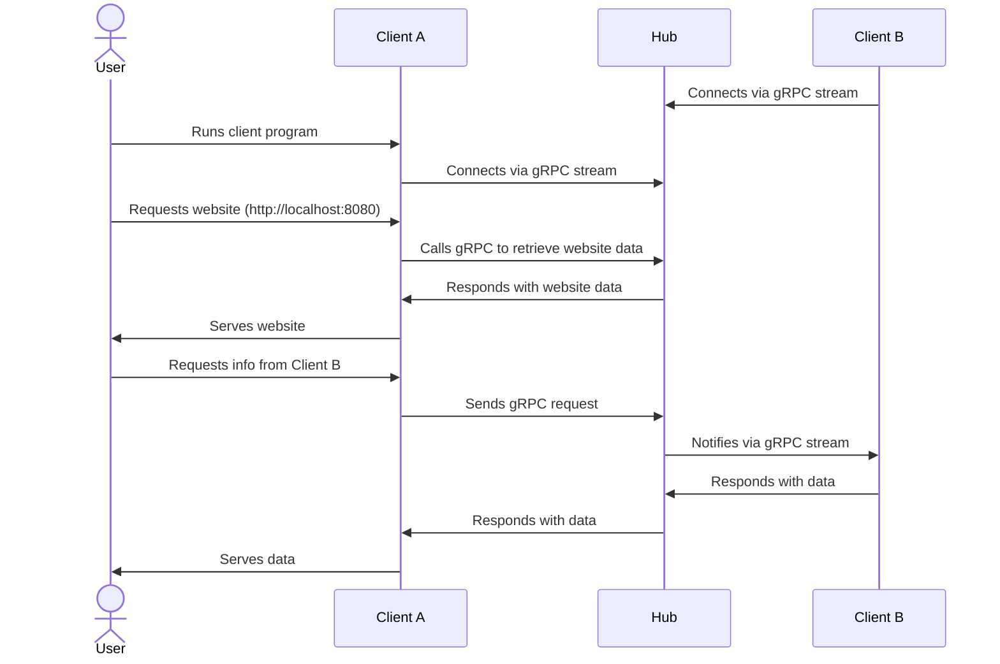

After my last post on [Creating a Networked Client to Power Centralized Insights](../distributed-dashboard), I started to think about how I could use a similar design to create a decentralized website. Users could run their clients locally, store information on their own machines, and connect to other clients from the central hub. An interesting design choice, I thought, would be for the website to only be accessible from the local network when the client is running.This would ensure that to be a participant in the network, you are also contributing to the network.

## The Design


Now this may look a bit complicated so let's break it down. The user runs a client program on their machine. This client connects to the hub and serves a website on `http://localhost:8080`. The user can then request data from other clients on the network. The client program will make a [gRPC](https://grpc.io/) call to the hub, which will then notify the other client to send the data. The hub will then send the data back to the client program, which will serve it to the user.

Ok, so how do I implement this?

## gRPC and Rust

First, let's create a new Rust project. I am calling it `irly` because I am not very creative with names. (Side note: I typed in "I am calling it `irly` because " and [copilot](https://github.com/features/copilot) suggested the rest. 😀)
```sh
cargo new irly
```

Before writing any code in Rust though, I need to make a proto definition for gRPC.

```proto
syntax = "proto3";

package irly.v1;

service Irly {
  rpc GetFile (GetFileRequest) returns (GetFileResponse);
} 

message GetFileRequest {
  string file_path = 1;
}

message GetFileResponse {
  string file_path = 1;
  bytes file_content = 2;
}
```

This proto file defines a service called `Irly` with a single method `GetFile`. This method takes a `GetFileRequest` and returns a `GetFileResponse`. The request contains a `file_path` and the response contains the `file_path` and the `file_content`. The idea is to imitate a file server in gRPC.

## Tonic

To set up a gRPC server in Rust, I used [tonic](https://github.com/hyperium/tonic). To install the dependencies, I first installed cargo-edit.

```sh
cargo install cargo-edit
```

This allows me to add dependencies to my `Cargo.toml` file with the `cargo add` command.

```sh
cargo add async-trait
# prost serializes and deserializes protobuf
cargo add prost
# tokio is needed for async
cargo add tokio -F full
# tonic is the gRPC library with gzip support
cargo add tonic -F gzip
# tonic-reflection is needed for reflection
cargo add tonic-reflection
# tonic-build is needed to compile the proto
cargo add --build tonic-build
```

Next, I have to add a step to the build so that the protobuf definition is compiled into Rust code. Fortunately, placing a file named `build.rs` in the root of a package will cause Cargo to compile that script and execute it just before building the package.

```rust
use std::error::Error;
use std::{env, path::PathBuf};

fn main() -> Result<(), Box<dyn Error>> {
    // Cargo sets OUT_DIR environment variable to the output directory
    let out_dir = PathBuf::from(env::var("OUT_DIR").unwrap());

    // Output the file descriptor for reflection
    tonic_build::configure()
        .file_descriptor_set_path(out_dir.join("irly_descriptor.bin"))
        .compile_protos(&["proto/irly/v1/files.proto"], &["proto"])?;

    // Compile the protobuf
    tonic_build::compile_protos("proto/irly/v1/files.proto")?;

    Ok(())
}
```

Next, I will setup the server. In `src/main.rs` I will add the following code.

```rust
// Create a module for the proto definition
mod proto {
    tonic::include_proto!("irly.v1");

    // Include the file descriptor set
    pub(crate) const FILE_DESCRIPTOR_SET: &[u8] = tonic::include_file_descriptor_set!("irly_descriptor");
}

use proto::irly_server::Irly;

// Implement the service
#[derive(Debug, Default)]
struct IrlyService {}

#[tonic::async_trait]
impl Irly for IrlyService {
    // Implement the GetFile method defined in the proto
    async fn get_file(
        &self,
        request: tonic::Request<proto::GetFileRequest>,
    ) -> Result<tonic::Response<proto::GetFileResponse>, tonic::Status> {
        let input = request.get_ref();

        if input.file_path.is_empty() {
            return Err(tonic::Status::invalid_argument("file_path is empty"));
        }

        println!("Request for file: {:?}", &input.file_path);

        let response = proto::GetFileResponse {
            file_path: input.file_path.clone(),
            file_content: String::from("content"),
        };

        Ok(tonic::Response::new(response))
    }
}

#[tokio::main]
async fn main() -> Result<(), Box<dyn std::error::Error>> {
    let addr = "[::1]:50051".parse()?;

    let irly = IrlyService::default();

    // Create a reflection service
    // (This is so clients do not need to know the proto definition)
    let service = tonic_reflection::server::Builder::configure()
        .register_encoded_file_descriptor_set(proto::FILE_DESCRIPTOR_SET)
        .build_v1()?;

    // Create the server
    tonic::transport::Server::builder()
        .add_service(service)
        .add_service(proto::irly_server::IrlyServer::new(irly))
        .serve(addr)
        .await?;

    Ok(())
}
```

This code sets up a gRPC server that listens on port `50051` and implements the `GetFile` method. The method simply returns a string "content" for any file path requested. I can manually call this method on command-line using the [grpcurl](https://github.com/fullstorydev/grpcurl?tab=readme-ov-file#installation) tool.

```sh
grpcurl -plaintext \
    -d '{"file_path": "test.html"}' \
    'localhost:50051' irly.v1.Irly.GetFile
```
Response:
```json
{
  "file_path": "test.html",
  "file_content": "content"
}
```

## The Client

Now, I need to create a client that can connect to the server and request a file. I will create a new file `src/client.rs` and add the following code. In `cargo.toml`, I will add the following line to include the client in the build.

```toml
[[bin]]
name = "hub"
path = "src/hub.rs"

[[bin]]
name = "client"
path = "src/client.rs"
```

With this I can run the different programs using `cargo run --bin <client|hub>`.

To run a quick test before implementing the desired functionality, I will add the following code to `src/client.rs`.

```rust
mod proto {
    tonic::include_proto!("irly.v1");
}

// Use the Client instead of the Server
use proto::irly_client::IrlyClient;

#[tokio::main]
async fn main() -> Result<(), Box<dyn std::error::Error>> {
    let addr = "http://localhost:50051";

    let mut client = IrlyClient::connect(addr).await?;

    let req = proto::GetFileRequest {
        file_path: "file.txt".to_string(),
    };

    let request = tonic::Request::new(req);
    
    let response = client.get_file(request).await?;

    println!("Response: {:?}", response.get_ref().file_content);

    Ok(())
}
```

Now, to run the gRPC server:
```
cargo run --bin hub
```
Then (in another shell) to run the client:
```
cargo run --bin client
```
Result:
```
Response: "content"
```

## Serving a Website

Ok, so the server is working and the client can request a file. Now I need to actually have the hub respond with file contents. Later, I might do something more interesting like serve an Angular or React app, but for now I'll create a simple index.html file in a new directory called `public`.

```html
<!DOCTYPE html>
<html lang="en">
    <head>
        <meta charset="UTF-8">
        <meta name="viewport" content="width=device-width, initial-scale=1.0">
        <title>irly</title>
    </head>
    <body>
        <h1>irly</h1>
        <p>Welcome to irly. You have successfully joined the network!</p>
    </body>
</html>
```

When a client requests the index.html file, the hub should respond with the contents of this file. To do this, I will read the file and return the contents in the response. 

First, I'll add a function to read an file from disk. I created a new file `src/file_reader.rs` and added the following code.

```rust
use tokio::fs;
use std::path::Path;

const PUBLIC_PATH: &'static str = "./public/";

pub async fn read(path: &str) -> Result<Vec<u8>, Box<dyn std::error::Error>> {
    let public_path = Path::new(PUBLIC_PATH).join(path);
    let bytes = match fs::read(public_path).await {
        Ok(bytes) => bytes,
        Err(e) => {
            eprintln!("Error reading file: {e:?}");
            return Err(Box::new(e));
        },
    };
    Ok(bytes)
}
``` 

Then in `hub.rs`, I'll add a few lines
```rust
mod file_reader;
```
```rust { linenos=1 }
#[tonic::async_trait]
impl Irly for IrlyService {
    async fn get_file(
        &self,
        request: tonic::Request<proto::GetFileRequest>,
    ) -> Result<tonic::Response<proto::GetFileResponse>, tonic::Status> {
        let input = request.get_ref();

        if input.file_path.is_empty() {
            return Err(tonic::Status::invalid_argument("file_path is empty"));
        }

        println!("Request for file: {:?}", &input.file_path);

        let file = file_reader::read(&input.file_path).await;

        if file.is_err() {
            return Err(tonic::Status::not_found("file not found"));
        }

        let mut file_path = input.file_path.clone();
        // Remove leading slash from path
        if input.file_path.starts_with('/') {
            file_path.remove(0);
        }
        // Default a request for "/" to index.html
        if &input.file_path == "/" {
            file_path = "index.html".to_string();
        }

        let response = proto::GetFileResponse {
            file_path: file_path.clone(),
            file_content: file.unwrap(),
        };

        Ok(tonic::Response::new(response))
    }
}
```

First, I added the module definition for the file reader. Then (starting on line 15) I added a call to the file reader in the `get_file` method. If the file is not found, I return a `not_found` status. Otherwise, I return the file contents in the response.

If I update the client to request `index.html`, I should see the contents of the file in the response.

Result:
```sh
% cargo run --bin client
    Finished `dev` profile [unoptimized + debuginfo] target(s) in 0.20s
         Running `target/debug/client`
         Response: "<!DOCTYPE html>\n<html lang=\"en\">\n<head>\n    <meta charset=\"UTF-8\">\n    <meta name=\"viewport\" content=\"width=device-width, initial-scale=1.0\">\n    <title>irly</title>\n</head>\n<body>\n    <h1>irly</h1>\n    <p>Welcome to irly. You have successfully joined the network!</p>\n</body>\n</html>\n"
```

## Back to the Client


Now that the hub is serving the website, I need to update the client to serve the website. I will use [warp](https://github.com/seanmonstar/warp) again since it worked well in the [previous post](../distributed-dashboard).

First, I will add the warp dependency to the client.
```sh
cargo add warp
```

Then, I will update the main function in `src/client.rs` to serve the website. 
```rust { linenos=1 }
#[tokio::main]
async fn main() -> Result<(), Box<dyn std::error::Error>> {
    let proxy_route = warp::path::full().and(warp::get()).and_then(web_handler);

    let routes = proxy_route.recover(handle_rejection);

    warp::serve(routes).run(([127, 0, 0, 1], 8080)).await;

    Ok(())
}
```

Notice on line 3, I am registering a route that will call the `web_handler` function whenever any route is requested. The full path is passed into the `web_handler` function as a FullPath struct. The path can be extracted and then forwarded to the hub to request the file contents.

```rust { linenos=1 }
async fn web_handler(path: warp::path::FullPath) -> Result<impl warp::Reply, warp::Rejection> {
    let addr = "http://localhost:50051";
    // Connect to the hub, accept Gzip, and set max message sizes
    let mut client = IrlyClient::connect(addr)
        .await
        .unwrap()
        .accept_compressed(CompressionEncoding::Gzip)
        .max_decoding_message_size(256 * 1024 * 1024)
        .max_encoding_message_size(256 * 1024 * 1024);

    let response = match request_file(&mut client, path.as_str()).await {
        Ok(response) => response,
        Err(e) => {
            eprintln!("Error: {e:?}");
            return Err(warp::reject::not_found());
        }
    };

    let res_ref = response.get_ref();

    Ok(warp::reply::with_header(
        res_ref.file_content.clone(),
        "content-type",
        mime_guess::from_path(&res_ref.file_path)
            .first_or_octet_stream()
            .to_string(),
    ))
}
```

This creates a gRPC client and passes it, along with the path, to the `request_file` function. If the file is not found, a `not_found` rejection is returned. Otherwise, the file contents are returned with the appropriate content type (using [mime_guess](https://docs.rs/mime_guess/latest/mime_guess/) for this.)


The `request_file` function is defined as follows:

```rust
async fn request_file(
    client: &mut IrlyClient<tonic::transport::channel::Channel>,
    path: &str,
) -> Result<tonic::Response<proto::GetFileResponse>, Box<dyn std::error::Error>> {
    let req = proto::GetFileRequest {
        file_path: path.to_string(),
    };

    let request = tonic::Request::new(req);

    let response = match client.get_file(request).await {
        Ok(response) => response,
        Err(e) => return Err(Box::new(e)),
    };

    Ok(response)
}
```

This function creates a `GetFileRequest` and sends it to the hub. If the request is successful, the response is returned. Otherwise, an error is returned.

## Does it work?

After spinning up the hub and the client again, here are the results of navigating to http://localhost:8080 in the browser.


So yes, it works! The client is serving the website from the hub. This is a simple example, but it demonstrates how a decentralized website could be created using gRPC and Rust. I think this could be a bit more interesting if the hub can facilitate peer discovery and the transfer of data between clients. That might be a topic for another post. 😄

Check out the code for this post on [GitHub](https://github.com/taylordeckard/irly).
